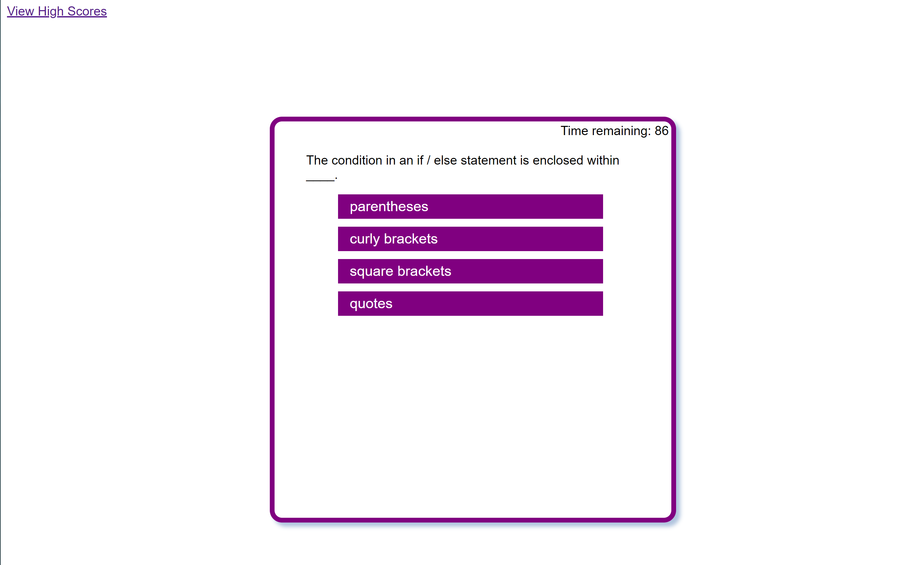

# 04-Code-Quiz

📝By Hannah Dowell

💻Deployed Code Quiz Page: https://hrdowell.github.io/04-Code-Quiz/

👩‍💻GitHub profile: https://github.com/hrdowell

## My Task

Create a code quiz that tracks high scores using JavaScript, Web API's, HTML, and CSS.


## User Story

```
AS A coding boot camp student
I WANT to take a timed quiz on JavaScript fundamentals that stores high scores
SO THAT I can gauge my progress compared to my peers
```

## Acceptance Criteria

```
GIVEN I am taking a code quiz
WHEN I click the start button
THEN a timer starts and I am presented with a question
WHEN I answer a question
THEN I am presented with another question
WHEN I answer a question incorrectly
THEN time is subtracted from the clock
WHEN all questions are answered or the timer reaches 0
THEN the game is over
WHEN the game is over
THEN I can save my initials and my score
```

## Mock-Up

The following animation demonstrates the application functionality:

)

## My Project

✨ My website opens with a landing page featuring a title, brief description, and a "Start Quiz" button. When the button is clicked, a 90-second timer is triggered, giving the user 15 seconds per question.


✨ Next, I appended an HTML page containing 6 multiple choice questions, with 4 possible answers each. For each wrong answer, 10 seconds are subtracted from the timer. All answers are recorded with an event listener that keeps track of all correct answers clicked. 



✨When the timer runs out, the page shows the user's final score and number of questions answered correctly. 


✨There is an input box for the user's initials to save to a local storage list of high scores. When the submit button is clicked, all of the high scores and the corresponding intials saved on the local storage are displayed. 


✨The user has the option to start over or clear the high scores. Below is a gif recording of my final website, accessible at the following URL: 💻🖱 https://hrdowell.github.io/04-Code-Quiz/


